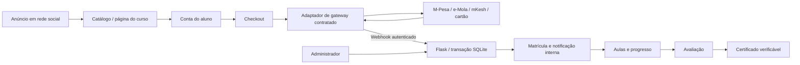

# Arquitetura e jornada CRISAVYA Learning

## Do anúncio ao certificado

1. Facebook, TikTok ou Instagram: anúncio com benefício real e ligação à página `/cursos/1`. Pode acrescentar parâmetros UTM para análise futura. Campanhas/pixels não são criados nem rastreamento instalado nesta versão.
2. Página de apresentação: programa, preço 750 MT, materiais disponíveis e condições de acesso. O visitante cria conta ou entra antes de comprar.
3. Checkout: nome/email/telefone já associados à conta; seleção da carteira/cartão. Não solicitar PIN M-Pesa/e-Mola/mKesh nem dados do cartão na aplicação.
4. Pedido `pending`: preço definido no servidor, não pelo navegador.
5. Gateway contratado: cobrança na carteira ou checkout alojado para cartão.
6. Confirmação autenticada no backend: pedido `paid`, matrícula ativada e notificação interna na mesma transação. O retorno do navegador nunca confirma o pagamento.
7. Área de aprendizagem: leitura/vídeo/material, conclusão de aulas e avaliação final.
8. Certificado de conclusão após aprovação: nome, curso, nota, data e identificador verificável. Não confere equivalência académica.

## Componentes e páginas

Backend Flask, templates Jinja, CSS/JS local e SQLite. Sem dependências de frontend ou CDN para a apresentação. Layout adaptado a telemóvel. A aplicação não faz streaming nem armazena os vídeos; incorpora URLs autorizadas do YouTube/Vimeo.

| Página | Acesso | Função |
| --- | --- | --- |
| `/` e `/cursos/<id>` | Público | Descoberta e apresentação |
| `/registar`, `/entrar` | Público | Identidade e sessão |
| `/checkout/<id>` | Aluno | Método e criação de pedido |
| `/pedidos/<id>` | Dono do pedido | Estado e demonstração |
| `/minha-conta` | Aluno | Cursos, pedidos e notificações |
| `/aprender/<id>` | Matrícula confirmada | Aulas e progresso |
| `/avaliacao/<id>` | Matrícula e aulas concluídas | Avaliação |
| `/certificados/<token>` | Público com token único | Verificação e impressão |
| `/admin`, `/admin/aulas/<id>` | Administrador | Catálogo, conteúdos e pedidos |
| `/api/payments/webhook` | Assinatura válida | Confirmação backend |
| `/saude` | Público | Disponibilidade da aplicação/base |

## Modelo de dados

- `users`: identidade, contacto, hash da palavra-passe e papel.
- `courses`: programa, preço inteiro em meticais, publicação e nota mínima.
- `lessons`: módulo, ordem, texto e URLs de vídeo/material.
- `questions`: enunciado, opções e índice da resposta correta, nunca enviado na página de avaliação.
- `orders`: identificador aleatório, aluno, curso, valor, método, origem demo/live e estado.
- `enrollments`: matrícula única por aluno/curso; associada ao pedido confirmado.
- `progress`: aulas concluídas por aluno.
- `attempts`: nota e data de cada avaliação.
- `certificates`: identificador aleatório único e emissão por aluno/curso.
- `notifications`: aviso interno, um por pedido.
- `payment_events`: identificadores únicos para evitar callbacks duplicados.

## Operação e limitações

A notificação «Pagamento confirmado. O seu curso já está disponível» é entregue na conta do aluno. SMS/email externos ainda não são enviados. Para os adicionar, implemente uma outbox e worker com tentativas, idempotência, consentimento e fornecedor contratado; não faça envio de SMS dentro da transação de matrícula.

A leitura pode ser marcada como concluída pelo aluno; isso mede conclusão declarada, não tempo assistido. O certificado requer também aprovação na avaliação. A versão inicial não inclui reembolso automático, edição completa de cursos/questões, upload de ficheiros, recuperação de palavra-passe, certificados assinados digitalmente nem aplicações móveis nativas.

Antes do lançamento comercial, publique termos, privacidade e reembolso adaptados ao negócio, obtenha autorização para conteúdos e prepare apoio ao aluno. As páginas públicas de certificado revelam nome/curso/nota a quem possuir a ligação: comunique isso ao aluno e mantenha o token privado até ele o partilhar.
